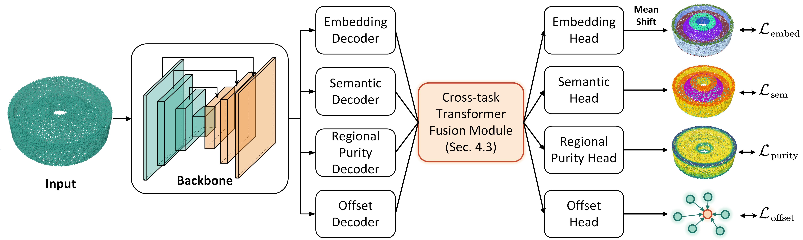

  

---
This repository hosts the implementation of TCIPS which is an innovative Transformer-based Cross-task Interactive Primitive Segmentation method.

The code will be uploaded once the paper is accepted for publication.

  

## 🛠️ Installation
coming soon

## 📊 Dataset
coming soon

## 🚀 Train
coming soon

## ✔️ Test
coming soon

## 🙏 Acknowledgment
This work was inspired by the following project: [PointTransformerV3](https://github.com/Pointcept/PointTransformerV3), [ParSeNet](https://github.com/Hippogriff/parsenet-codebase), [HPNet](https://github.com/SimingYan/HPNet), [SED-Net](https://github.com/yuanqili78/SED-Net), [DeMT](https://github.com/yangyangxu0/DeMT), [Pointcept](https://github.com/Pointcept/Pointcept).

## 📄 Citation